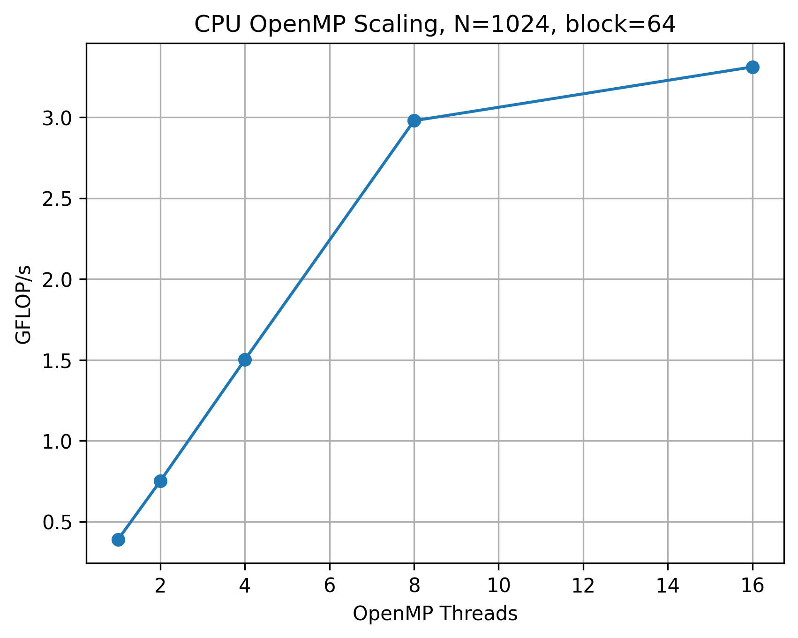
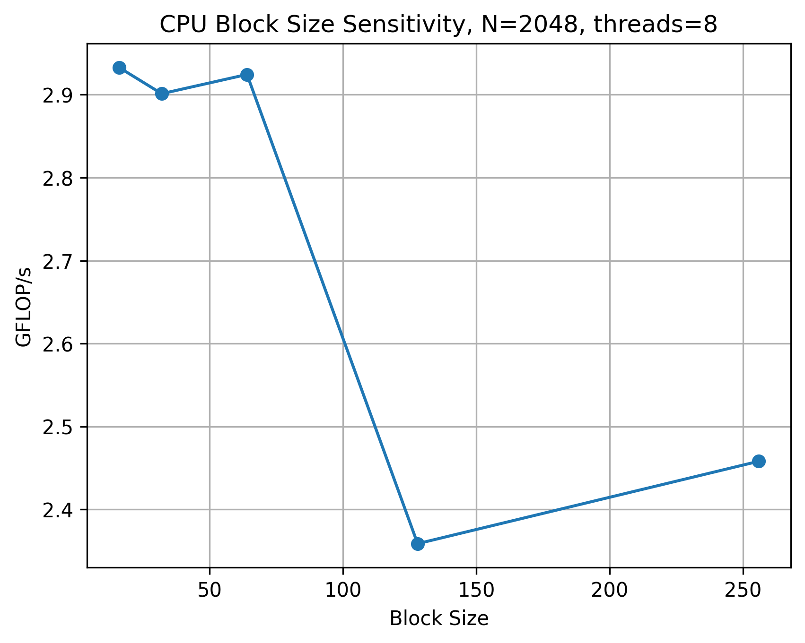

# CAKE-Inspired Communication-Avoiding GEMM with GPU Acceleration

## Overview

This project explores communication-avoiding matrix multiplication using a CAKE-inspired tiled GEMM approach with GPU acceleration.

The objective is to study how tiling and scheduling strategies affect performance, particularly in terms of:

- data locality
- GPU utilization
- kernel launch overhead
- arithmetic intensity

We compare a CAKE-style tiled approach against a highly optimized cuBLAS baseline.

---

## Motivation

Matrix multiplication is a fundamental building block in:

- scientific computing
- numerical linear algebra
- deep learning
- high-performance computing (HPC)

Modern GPUs provide massive compute capability, but performance is often limited by:

- memory bandwidth
- data movement
- kernel scheduling overhead

This project investigates how communication-avoiding ideas (CAKE-style tiling) influence performance on GPU architectures.

---

## System Configuration

Experiments were conducted on:

- GPU: NVIDIA RTX A4500
- CUDA: 12.4
- Compiler: GCC 11.3
- Build system: CMake
- Library: cuBLAS

---

## Implemented Methods

### 1. CPU Naive GEMM

Basic triple-loop implementation.

Used only for correctness and baseline comparison.

---

### 2. CPU Blocked GEMM

Cache-aware implementation using:

- blocking (tiling)
- OpenMP parallelism

Improves memory locality and CPU utilization.

---

### 3. Full GPU cuBLAS GEMM

Uses cublasSgemm().

This is the performance baseline, representing highly optimized vendor implementation.

---

### 4. CAKE-Style Tiled GPU GEMM

A tiled GEMM approach inspired by communication-avoiding principles.

Structure:

for each C tile:
keep C tile active
for each K tile:
C_tile += A_tile × B_tile

Key idea:

- reuse data within tiles
- reduce unnecessary data movement
- expose locality vs overhead tradeoff

Each tile multiplication is performed using cuBLAS.

---

## Repository Structure

cake-gemm/
├── CMakeLists.txt
├── README.md
├── include/
│ ├── matrix.h
│ └── timer.h
├── src/
│ ├── main.cpp
│ ├── cpu/
│ │ ├── naive_gemm.cpp
│ │ └── blocked_gemm.cpp
│ ├── gpu/
│ │ ├── cublas_gemm.cu
│ │ └── tiled_gemm.cu
│ └── utils/
│ ├── matrix.cpp
│ └── timer.cpp
├── scripts/
│ └── plot_results.py
└── results/
├── summary.csv
└── plots/

---

## Build Instructions

export CUDA_HOME=/usr/local/cuda
export PATH=$CUDA_HOME/bin:/home/software/gcc/gcc-11.3.0/bin:$PATH
export LD_LIBRARY_PATH=/home/software/gcc/gcc-11.3.0/lib64:$CUDA_HOME/lib64:$LD_LIBRARY_PATH
export CUDACXX=$CUDA_HOME/bin/nvcc

rm -rf build
mkdir build
cd build

cmake ..
-DCMAKE_CUDA_COMPILER=/usr/local/cuda/bin/nvcc
-DCMAKE_CUDA_ARCHITECTURES=86

make -j

---

## Run Instructions

CPU:

./cake_gemm 1024 64

GPU (cuBLAS baseline):

./cake_gemm_gpu 4096
./cake_gemm_gpu 8192
./cake_gemm_gpu 16384

CAKE-style tiled GPU:

./cake_gemm_tiled_gpu 4096 512
./cake_gemm_tiled_gpu 4096 1024
./cake_gemm_tiled_gpu 4096 2048

./cake_gemm_tiled_gpu 8192 1024
./cake_gemm_tiled_gpu 8192 2048
./cake_gemm_tiled_gpu 8192 4096

---

## Results Summary

N = 4096
Full cuBLAS: ~15016 GFLOP/s
Tiled 1024: ~13103 GFLOP/s
Tiled 2048: ~13344 GFLOP/s

N = 8192
Full cuBLAS: ~15427 GFLOP/s
Tiled 1024: ~11364 GFLOP/s
Tiled 2048: ~12074 GFLOP/s
Tiled 4096: ~12562 GFLOP/s

N = 16384
Full cuBLAS: ~15106 GFLOP/s
Tiled 1024: ~11109 GFLOP/s
Tiled 2048: ~11764 GFLOP/s
Tiled 4096: ~12229 GFLOP/s

---

## Key Observations

- Full cuBLAS achieves peak performance (~15 TFLOP/s).
- Tiled GEMM improves as tile size increases.
- Small tiles suffer from overhead (many cuBLAS calls).
- Large tiles improve arithmetic intensity and GPU utilization.
- Tiled approach approaches but does not surpass full cuBLAS.

---

## CPU OpenMP Results

The CPU blocked GEMM implementation was evaluated using OpenMP. For `N=1024` and block size `64`, performance improved as the number of threads increased.

| N    | Block Size | Threads | Time (s) | GFLOP/s |
| ---- | ---------: | ------: | -------: | ------: |
| 1024 |         64 |       1 |    5.517 |   0.389 |
| 1024 |         64 |       2 |    2.859 |   0.751 |
| 1024 |         64 |       4 |    1.430 |   1.501 |
| 1024 |         64 |       8 |    0.721 |   2.979 |
| 1024 |         64 |      16 |    0.649 |   3.311 |

The CPU implementation scales well up to 8 threads, then begins to saturate. This is expected because blocked GEMM becomes increasingly limited by memory hierarchy behavior and cache reuse.

### CPU Tile Sensitivity

For `N=2048` with 8 OpenMP threads:

| N    | Block Size | Threads | Time (s) | GFLOP/s |
| ---- | ---------: | ------: | -------: | ------: |
| 2048 |         16 |       8 |    5.858 |   2.933 |
| 2048 |         32 |       8 |    5.922 |   2.901 |
| 2048 |         64 |       8 |    5.875 |   2.924 |
| 2048 |        128 |       8 |    7.284 |   2.359 |
| 2048 |        256 |       8 |    6.989 |   2.458 |

Block sizes between `16` and `64` perform best. Larger blocks reduce cache locality and hurt CPU performance.

## CPU Plots

### OpenMP Scaling

### CPU Block Size Sensitivity

---

## Conclusion

This project demonstrates the core tradeoff in communication-avoiding algorithms:

- smaller tiles → more flexibility but higher overhead
- larger tiles → better performance but reduced flexibility

The CAKE-style tiled implementation effectively illustrates how scheduling and locality influence performance on GPUs.

---

## Future Work

- Add CUDA streams to overlap independent tiled GEMM operations
- Implement double buffering to overlap data movement and computation
- Explore asynchronous tile scheduling for better GPU utilization
- Extend the implementation to distributed-memory GEMM using MPI
- Add roofline analysis to quantify compute-bound vs memory-bound behavior
- Compare CAKE-style tiling against other communication-avoiding GEMM strategies
- Evaluate performance on larger multi-GPU or multi-node systems
