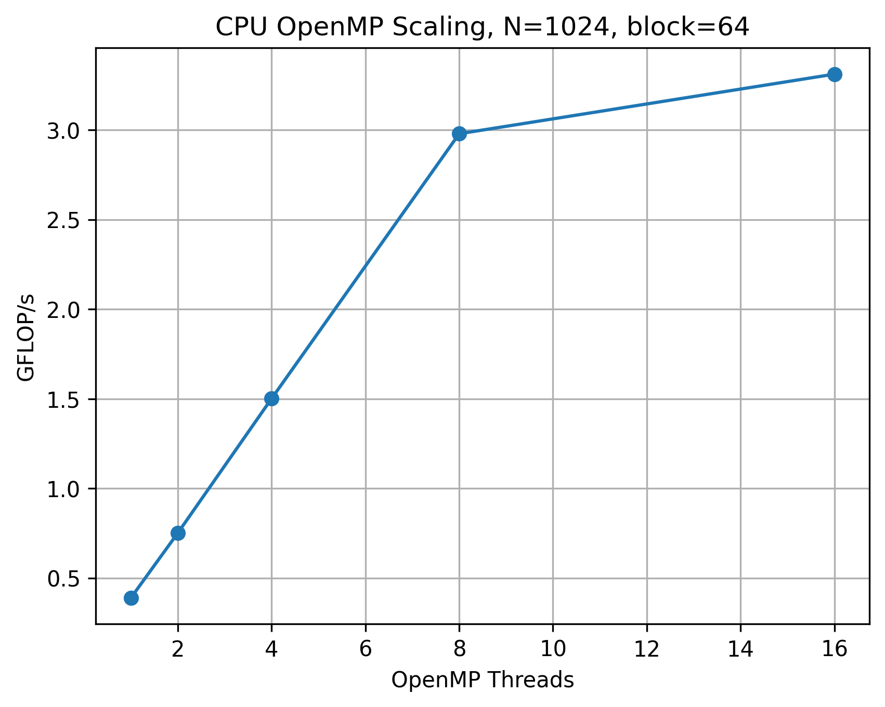
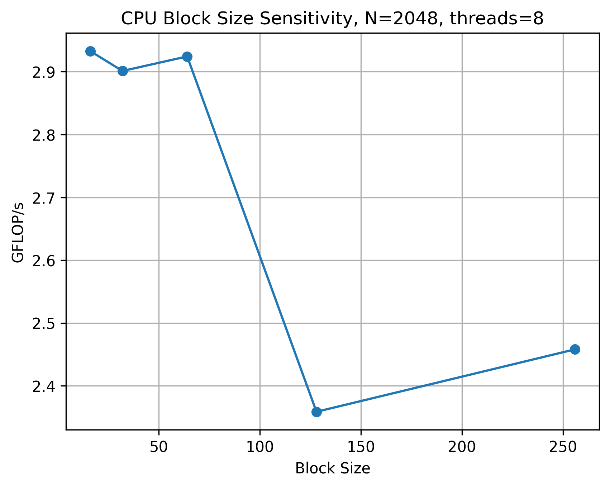
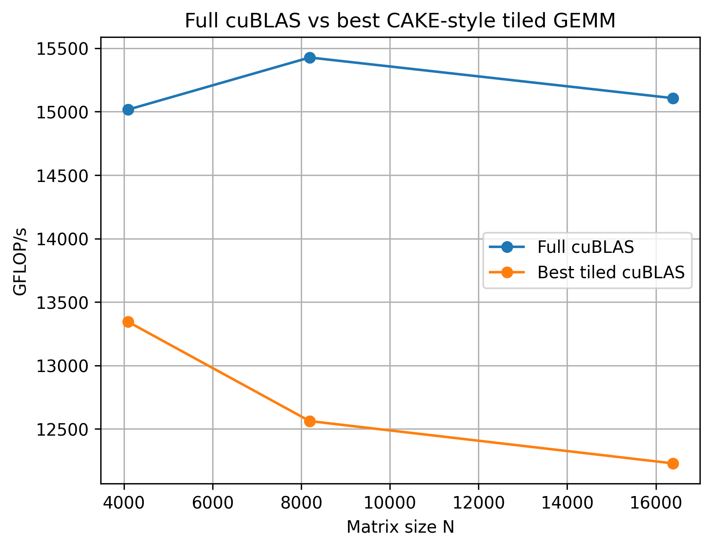
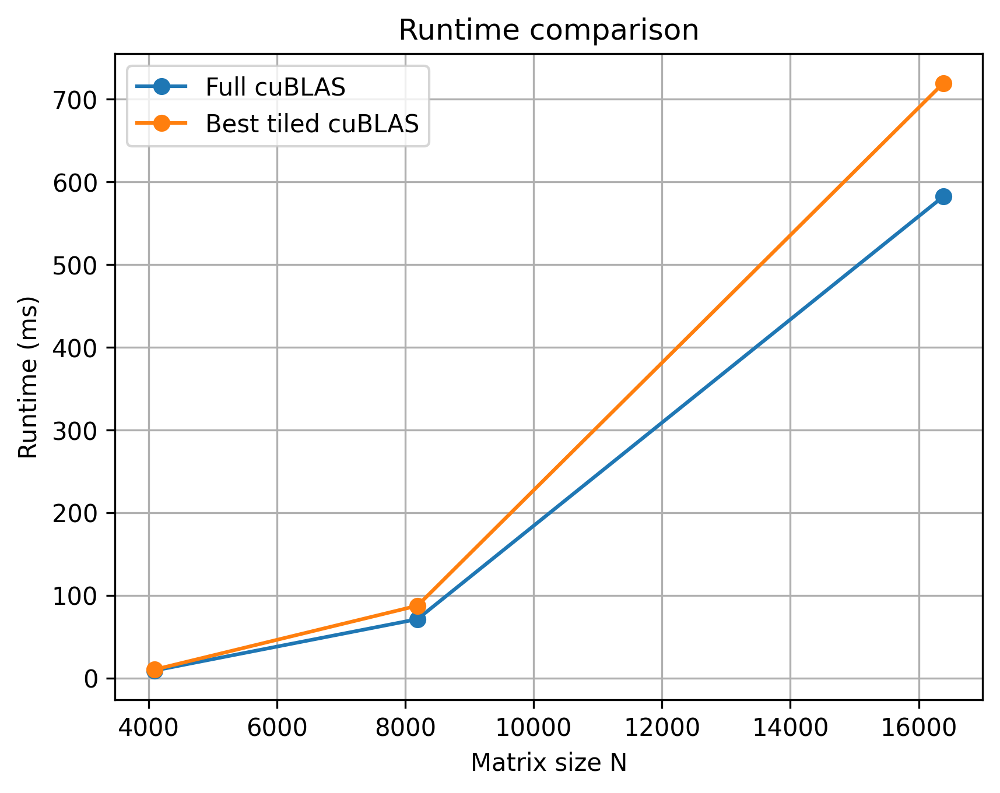
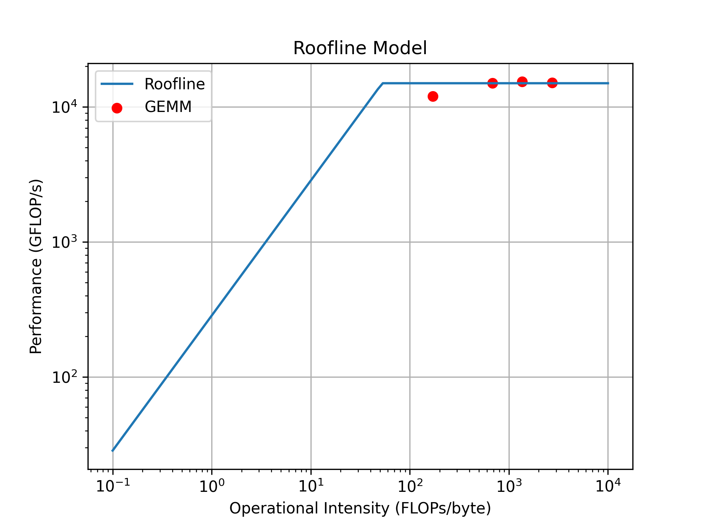

# CAKE-Inspired Communication-Avoiding GEMM with GPU Acceleration

## Overview

This project explores communication-avoiding matrix multiplication using a CAKE-inspired tiled GEMM approach with GPU acceleration.

The objective is to study how **tiling and scheduling strategies affect performance**, particularly in terms of:

- data locality
- GPU utilization
- kernel launch overhead
- arithmetic intensity

A CAKE-style tiled approach is compared against a highly optimized **cuBLAS baseline**, along with CPU OpenMP baselines.

---

## Motivation

Matrix multiplication is a fundamental building block in:

- scientific computing
- numerical linear algebra
- deep learning
- high-performance computing (HPC)

Modern hardware performance is often limited not just by compute, but by:

- memory bandwidth
- data movement
- cache efficiency
- scheduling overhead

This project investigates how **communication-avoiding ideas (CAKE-style tiling)** influence performance across CPU and GPU architectures.

---

## System Configuration

Experiments were conducted on:

- **GPU:** NVIDIA RTX A4500
- **CUDA:** 12.4
- **CPU:** Multi-core x86 system
- **Compiler:** GCC 11.3
- **Build system:** CMake
- **Libraries:** cuBLAS, OpenMP

---

## Implemented Methods

### 1. CPU Naive GEMM

Basic triple-loop implementation:

```

O(N³) computation without optimization

```

Used only for correctness and baseline comparison.

---

### 2. CPU OpenMP Blocked GEMM

Cache-aware implementation using:

- blocking (tiling)
- OpenMP parallelism
- SIMD vectorization

Improves memory locality and CPU utilization.

---

### 3. Full GPU cuBLAS GEMM

Uses:

```cpp
cublasSgemm()
```

This serves as the **performance baseline**, representing highly optimized vendor implementation.

---

### 4. CAKE-Style Tiled GPU GEMM

A tiled GEMM approach inspired by communication-avoiding principles.

Structure:

```
for each C tile:
    keep C tile active
    for each K tile:
        C_tile += A_tile × B_tile
```

Key idea:

- reuse data within tiles
- reduce unnecessary data movement
- expose locality vs overhead tradeoff

Each tile multiplication is performed using cuBLAS.

---

## Repository Structure

```
cake-gemm/
├── CMakeLists.txt
├── README.md
├── include/
│   ├── matrix.h
│   └── timer.h
├── src/
│   ├── main.cpp
│   ├── cpu/
│   │   ├── naive_gemm.cpp
│   │   └── blocked_gemm.cpp
│   ├── gpu/
│   │   ├── cublas_gemm.cu
│   │   └── tiled_gemm.cu
│   ├── utils/
│   │   ├── matrix.cpp
│   │   └── timer.cpp
│   └── analysis/
│       └── bandwidth.cu
├── scripts/
│   ├── plot_results.py
│   ├── plot_cpu_results.py
│   └── plot_roofline.py
└── results/
    ├── summary.csv
    ├── cpu_summary.csv
    └── plots/
```

---

## Build Instructions

```bash
export CUDA_HOME=/usr/local/cuda
export PATH=$CUDA_HOME/bin:/home/software/gcc/gcc-11.3.0/bin:$PATH
export LD_LIBRARY_PATH=/home/software/gcc/gcc-11.3.0/lib64:$CUDA_HOME/lib64:$LD_LIBRARY_PATH
export CUDACXX=$CUDA_HOME/bin/nvcc

rm -rf build
mkdir build
cd build

cmake .. \
  -DCMAKE_CUDA_COMPILER=/usr/local/cuda/bin/nvcc \
  -DCMAKE_CUDA_ARCHITECTURES=86

make -j
```

---

## Run Instructions

### CPU

```bash
./cake_gemm 1024 64
```

---

### GPU (cuBLAS baseline)

```bash
./cake_gemm_gpu 4096
./cake_gemm_gpu 8192
./cake_gemm_gpu 16384
```

---

### CAKE-style tiled GPU

```bash
./cake_gemm_tiled_gpu 4096 512
./cake_gemm_tiled_gpu 4096 1024
./cake_gemm_tiled_gpu 4096 2048

./cake_gemm_tiled_gpu 8192 1024
./cake_gemm_tiled_gpu 8192 2048
./cake_gemm_tiled_gpu 8192 4096
```

---

## CPU OpenMP Results

### OpenMP Scaling (N=1024, block=64)

| Threads | GFLOP/s |
| ------- | ------- |
| 1       | 0.39    |
| 2       | 0.75    |
| 4       | 1.50    |
| 8       | 2.98    |
| 16      | 3.31    |

Scaling is good up to 8 threads, after which performance saturates due to memory and cache limitations.

---

### CPU Block Size Sensitivity (N=2048, threads=8)

| Block Size | GFLOP/s |
| ---------- | ------- |
| 16         | 2.93    |
| 32         | 2.90    |
| 64         | 2.92    |
| 128        | 2.36    |
| 256        | 2.46    |

Best performance occurs for block sizes between **16–64**, which maximize cache locality.

---

### CPU Plots

#### OpenMP Scaling



#### Block Size Sensitivity



---

## GPU Results Summary

Full cuBLAS achieves ~15 TFLOP/s peak performance.

CAKE-style tiled GEMM improves with tile size:

| N     | Tile | GFLOP/s |
| ----- | ---- | ------- |
| 4096  | 1024 | ~13103  |
| 4096  | 2048 | ~13344  |
| 8192  | 2048 | ~12074  |
| 8192  | 4096 | ~12562  |
| 16384 | 4096 | ~12229  |

---

### GPU Plots

#### Full vs Tiled



#### Runtime Comparison



---

## Roofline Analysis

Measured GPU memory bandwidth:

```
≈ 285 GB/s
```

Peak compute:

```
≈ 15000 GFLOP/s
```

Ridge point:

```
≈ 52 FLOPs/byte
```

GEMM operational intensity:

```
I ≈ N / 6
```

This places GEMM firmly in the **compute-bound region**.

---

### Roofline Plot



---

## Key Insights

- GEMM is **compute-bound on GPU**, not memory-bound.
- cuBLAS reaches near-peak performance (~15 TFLOP/s).
- CAKE-style tiling improves performance as tile size increases.
- Smaller tiles introduce overhead and reduce efficiency.
- CPU performance is limited by memory hierarchy and cache behavior.

---

## CPU vs GPU Comparison

The CPU implementation lies closer to the memory-bound region due to limited cache bandwidth and lower compute throughput (~3.3 GFLOP/s).

In contrast, the GPU operates in the compute-bound region, achieving ~15 TFLOP/s.

This highlights the architectural difference:

- CPUs → memory-bound behavior
- GPUs → compute-bound efficiency

---

## Conclusion

This project demonstrates the core tradeoff in communication-avoiding algorithms:

- smaller tiles → more flexibility but higher overhead
- larger tiles → better performance but reduced scheduling flexibility

CAKE-style tiling successfully exposes locality and scheduling tradeoffs, while cuBLAS remains the optimal implementation due to global optimization.

---

## Future Work

- Add CUDA streams to overlap independent tiled GEMM operations
- Implement double buffering for compute–memory overlap
- Explore asynchronous tile scheduling
- Extend to distributed-memory GEMM using MPI
- Perform detailed roofline-based performance modeling
- Evaluate multi-GPU and multi-node scalability

---

## Author

Pratyush Kumar
MS Computer Science, Penn State
